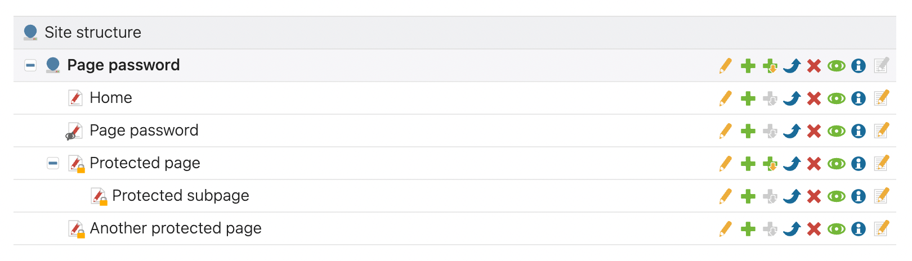

# Page Password for Contao Open Source CMS

[](https://packagist.org/packages/codefog/contao-page-password)
[](https://github.com/codefog/contao-page-password/blob/main/LICENSE)
[](https://packagist.org/packages/codefog/contao-page-password)

Page Password is a bundle for the [Contao CMS](https://contao.org).

The extension allows you to protect the selected pages with a password.

## Installation

Install the bundle via Composer:

```
composer require codefog/contao-page-password
```

## Configuration

1. Create a frontend module of "Page password" type.
2. Create a hidden page with the created frontend module on it. This will be a page that is displayed when a visitor is not authenticated.
3. Edit the settings of chosen pages and enable the "Protect page with password" checkbox. Then, enter your password and choose the hidden page you have just created.
4. Done!



## Copyright

This project has been created and is maintained by [Codefog](https://codefog.pl).
